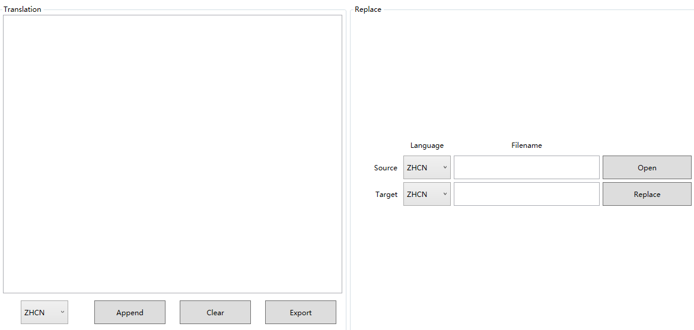

# ResourceTranslator
**Overview**

A GUI tool for replacing string resources (*.resx or *.xaml). 

Can be used in WPF-based application development.

- Load translations from Excel (*.xlsx)
- Load string resources from Resource (*.resx or *.xaml)
- Export translations to Excel (*.xlsx)
- Replace string resources with a new translation (*.resx or *.xaml)





**Dependency**


```
PM> Install-Package ClosedXML
```


**Locale**

| code  | lang              |
| ----- | ----------------- |
| zh-CN | Chinese - China   |
| en-US | English-US        |
| pt-BR | Portuguese-Brazil |
| es-ES | Spanish-Spain     |


**Example**

| Key                | zh-CN                  | en-US                              | pt-BR                                      | es-ES                                  |
| ------------------ | ---------------------- | ---------------------------------- | ------------------------------------------ | -------------------------------------- |
| strLicenseExpired  | 许可证已过期           | License is Expired                 | Licença expirada                           | La licencia expiró                     |
| strLicenseNotFound | 许可证未找到           | License Not Found                  | Licença não encontrada                     | Licencia no encontrada                 |
| strLicenseNotMatch | 许可证信息不匹配       | License Information does not Match | As informações de licença não correspondem | La información de licencia no coincide |
| strLicenseInvalid  | 许可证包含不正确的信息 | License is Invalid                 | A licença é inválida                       | Licencia inválida                      |

